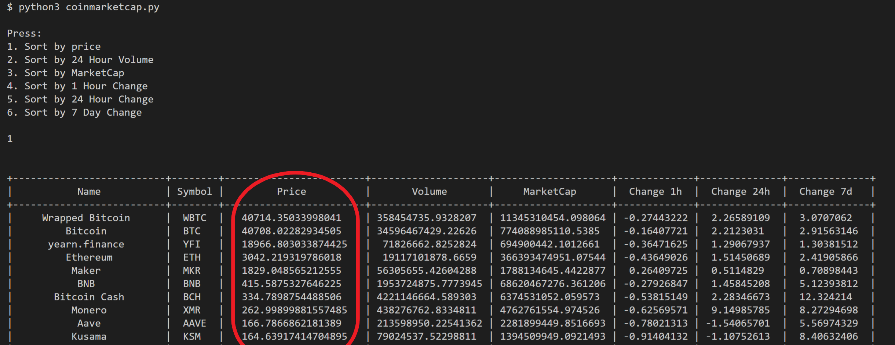
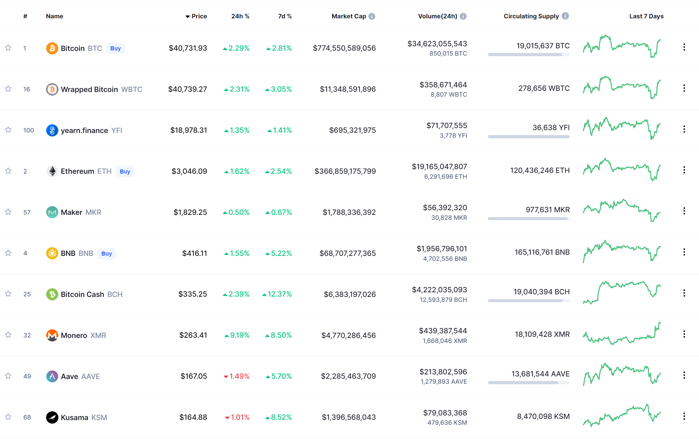
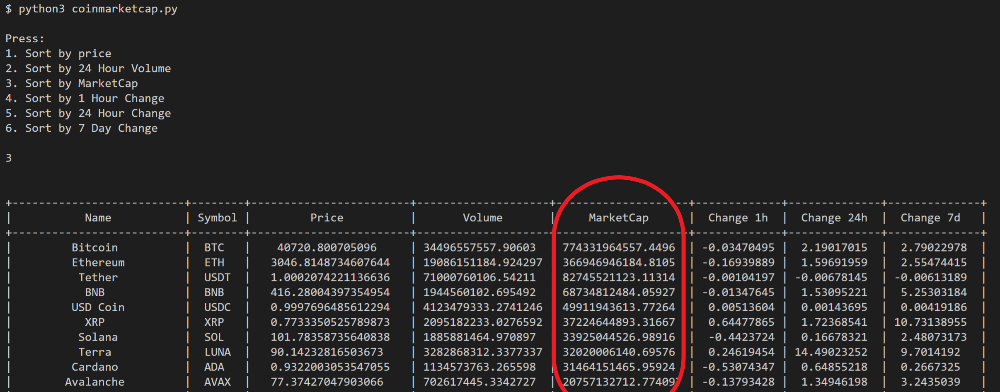

<h1 align='center'>    </h1>

### Overview: 
program that parses through coinmarketcap api using `python`, `requests`, and `prettytable` to generate the top 100 cryptocurrencies

### to run: 
download repo and input commands ``` python3 coinmarketcap.py ``` in the root folder  <br>  
(for demonstration purposes only top 10 cryptocurrencies are shown)







